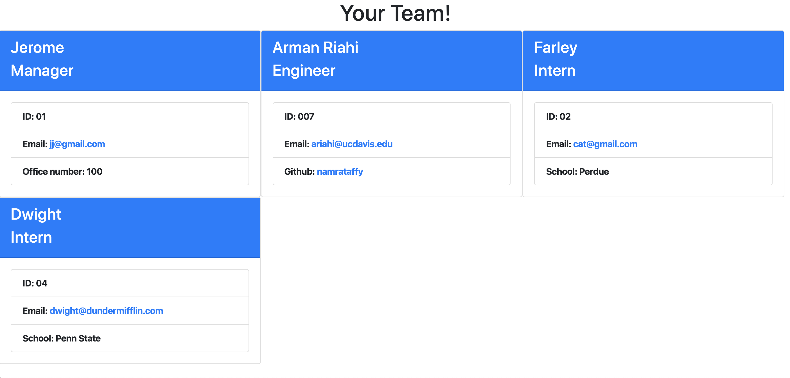
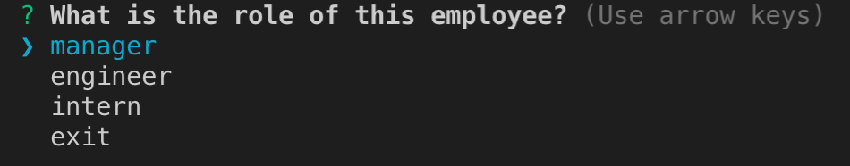
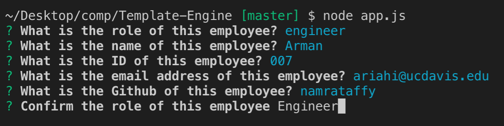

# Template-Engine

<br>

# Summary

This is an app that allows a user to generate a team by taking information about the various employees. There are manager, engineer, and intern options that the user can initially choose from. Then based off the role, a specific series of questions will be asked. Finally, an HTML page will be dynamically generated to display the team.
<br>

# Sample Images

Generated Team

<br>
Initial quesiton prompt

<br>
Supplemental question (for engineer)

<br>

# Technologies

- HTML
- CSS
- VScode
- Git
- GitHub
- Javascript
- Node.js
- Inquirer
- Jest

# Author

Arman Riahi

# Links

[LinkedIn](https://www.linkedin.com/in/arman-riahi/)
<br>

[GitHub](https://github.com/namrataffy)
<br>

# Code Snippet

Code showing how engineer class is created:

```
const Employee = require("./employee");

class Engineer extends Employee {
  constructor(name, id, email, github, title, specific) {
    super(name, id, email);
    this.title = title;
    this.github = github;
    this.specific =
      "Github: <a href='https://github.com/" + github + "'>" + github + "</a>";
  }
  getGithub() {
    return this.github;
  }
  getRole() {
    return this.constructor.name;
  }
}

module.exports = Engineer;

```
